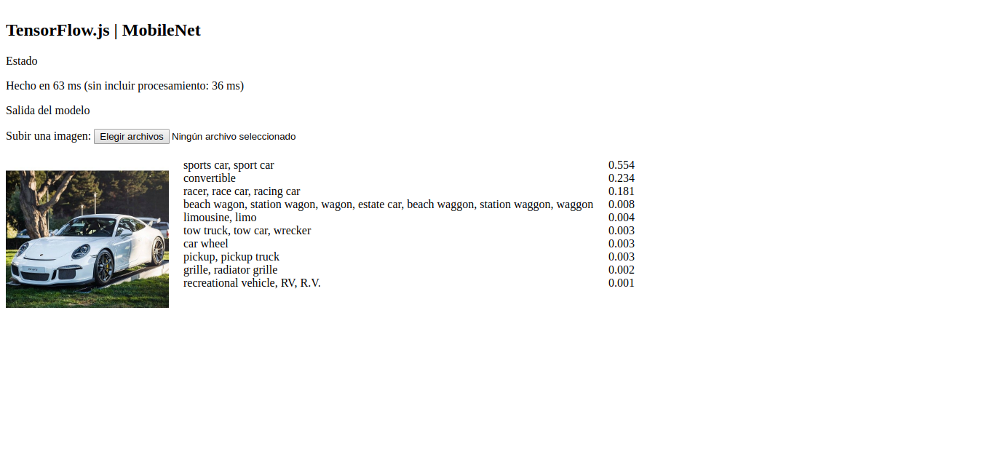

# TensorFlow.js | Mobilenet



Para este proyecto se ha usado la librería de JavaScript TensorFlowJS<br>
que usa un modelo de clasificación de imágenes MobileNet.<br>
Se re-entrenará el modelo con un dataset de coches Porche y No Porche<br>
con el objetivo de el modelo aprenda a distinguir entre uno y otro.<br>
Para realizar el re-entrenamiento se ha usado Colab de Google.<br>

Modelo usado
[aqui](https://github.com/fchollet/deep-learning-models/releases/download/v0.6/mobilenet_2_5_224_tf.h5)
Keras pre-entrenado, modelo mobilenet.

## Instalación:
```Bash
npm install
```
```Bash
yarn install
```

## Ejecución:

Desarrollo:
```Bash
$ npm run watch
```
Producción
```Bash
$ npm run build
```

... y corre en puerto: http://localhost:1234/

---

# Reentrenar Modelo con dataset Porsche

#### 00 Comprobar TensorFlow en Python

Para uso en Colab usar archivo: Colab_ReentrenarModelo_P2. ipynb

```bash
!python -c 'import tensorflow as tf; print(tf.__version__)'
```
Si no está agegado:
```bash
pip install tensorflowjs
```
#### 01 InicioCrear carpeta 
Se crea en root por defecto
```bash
mkdir ~/reentrenar

pwd

cd /root/reentrenar

pwd
```
#### Traer imagen reentrenada a la carpeta
```bash
!curl -LO https://github.com/tensorflow/hub/raw/master/examples/image_retraining/retrain.py

ls
```
#### Crear dataset de imágenes
```bash
mkdir dataset

ls

mkdir dataset/porche/ dataset/no-porche/

ls dataset
```
#### Subir set de imagenes

#### Reentrenar modelo:

#### Solo con el dataset
```bash
ls

!python retrain.py --image_dir ./dataset
```
#### Reenternar modelo dependiente de mibilenet model[texto del enlace](https://)
```bash
!python retrain.py \
    --image_dir ./dataset \
    --tfhub_module https://tfhub.dev/google/imagenet/mobilenet_v2_100_224/feature_vector/2
```
#### Modelo reentrenado en carpeta temporal: /tmp/output_graph.pb
- Archivo: **output_graph.pb**
- Archivo: **output_labels.txt**

```bash
ls /tmp
```
#### Exportar modelo JSON: 
```bash
mkdir salida

!tensorflowjs_converter \
    --input_format=tf_hub \
    --output_format=tfjs_graph_model \
    --saved_model_tags=serve \
    /tmp/output_graph.pb \
    salida
```
#### Probando modelo con una imagen: prueba.jpg
```bash
!curl -LO https://github.com/tensorflow/tensorflow/raw/master/tensorflow/examples/label_image/label_image.py
!python label_image.py \
--graph=/tmp/output_graph.pb --labels=/tmp/output_labels.txt \
--input_layer=Placeholder \
--output_layer=final_result \
--image=prueba.jpg
```
